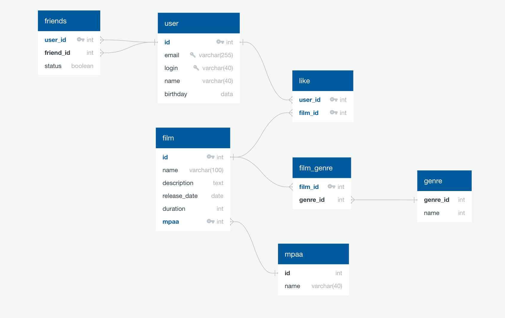

# java-filmorate
Template repository for Filmorate project.<br>
В талице User поле friend является списком типа user. В поле status заложена логика
статус для связи «дружба» между двумя пользователями:
- неподтверждённая — когда один пользователь отправил запрос на добавление другого пользователя в друзья,
- подтверждённая — когда второй пользователь согласился на добавление.<br>
  Похожа логика в таблице Film, поле rate ссылается на таблицу, в которой будут количество лайков.


Примеры запросов для основных операций вашего приложения<br>
Выведем первых 10 пользователей, а именно их id и email
```SQL
SELECT user_id,
       email,
FROM user
LIMIT 10; 

```
Отсортируем рейтинг фильма от большего к меньшему и выведем их название
```SQL
SELECT name
FROM film
GROUP BY name
ORDER BY AVG(rate); 

```
Код по которому формируется база данных.
```SQL
user
-
id PK int
email UNIQUE varchar(255)
login UNIQUE varchar(40)
name varchar(40)
birthday data

film
-
id PK int
name varchar(100)
description text
release_date date
duration int
mpaa PK int FK >- mpaa.id

friends
-
user_id PK int FK >- user.id
friend_id int FK >- user.id
status boolean

like
-
user_id PK int FK >- user.id
film_id PK int FK >- film.id

film_genre
-
film_id PK int FK >- film.id
genre_id FK >- genre.genre_id

genre
-
genre_id
name

mpaa
-
id int
name varchar(40)
```

